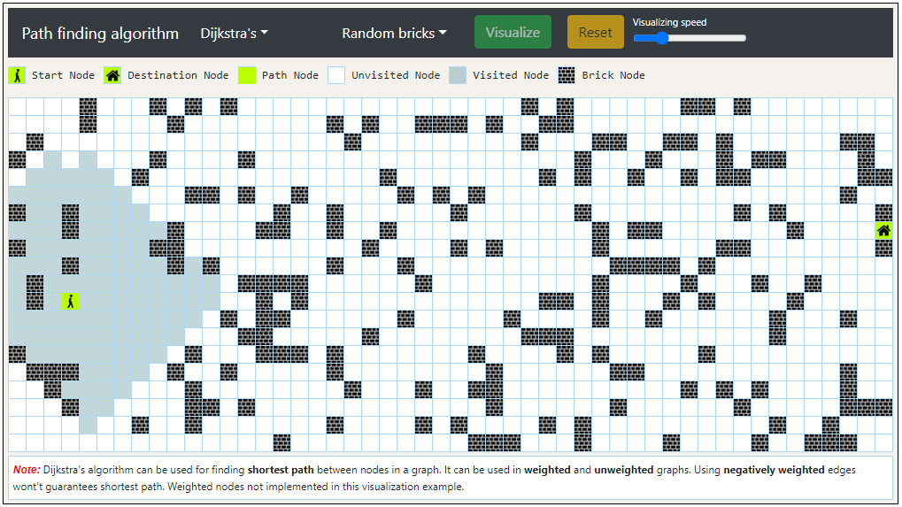
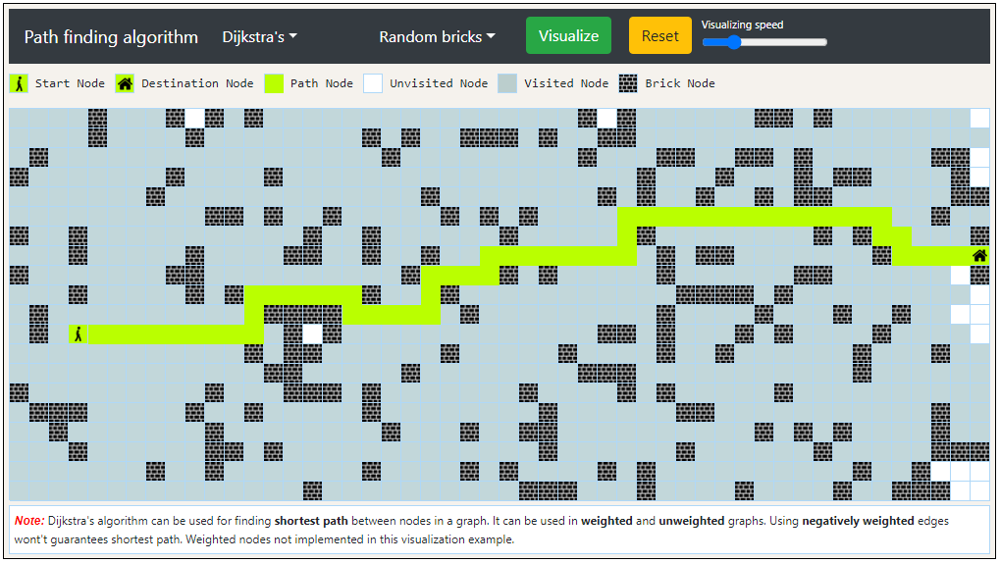

# Path finding visualizer

Visualize different path finding algorithms

### How to run

npm install

npm start

### Algorithms

### Path finding

1. Dijkstra's algorithm
2. A\* (A Star)
3. Breadth-first search
4. Depth-first search

### Maze generation

1. Recursive division
2. Random bricks
3. Diagonal brick lines

### Screenshot

#### 1. Initial stage

#### 2. Terrain selected

#### 3. Path finding in-progress

#### 4. Shortest path

